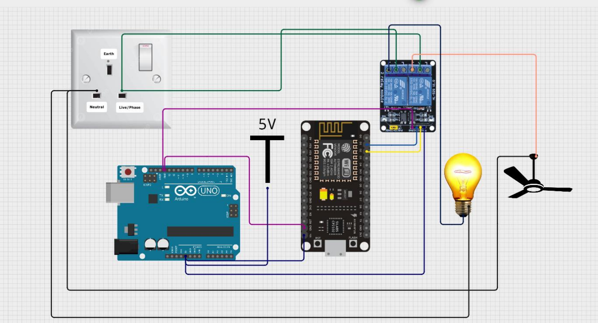
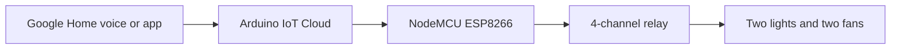

# Smart Home Automation with ESP8266 and Arduino IoT Cloud

[](https://www.espressif.com/en/products/socs/esp8266)
[](https://cloud.arduino.cc/)
[](https://home.google.com/)
[](LICENSE)

An IoT-based home automation system that controls **two lights and two fans**
using a NodeMCU ESP8266 and a four-channel relay module. Appliances can be
operated with Google Home voice commands or manually using digital switches in
the Google Home app.



## Features

- Independent control of two lights and two fans
- Voice control through Google Home
- Manual remote control through the Google Home app
- Arduino IoT Cloud synchronization over Wi-Fi
- Active-LOW relay handling
- Safe OFF state for all appliances when the controller starts
- Serial status messages for testing and troubleshooting

## System architecture



## Hardware

| Component | Quantity | Purpose |
| --- | ---: | --- |
| NodeMCU ESP8266 development board | 1 | Wi-Fi-enabled controller |
| Four-channel 5 V relay module | 1 | Switches four appliance channels |
| Lights | 2 | Controlled loads |
| Fans | 2 | Controlled loads |
| Regulated power supply | 1 | Powers the controller and relay board |
| Wi-Fi network and smartphone | 1 each | Cloud connectivity and user control |

> [!NOTE]
> The original circuit diagram includes an Arduino Uno, but the firmware runs
> entirely on the NodeMCU ESP8266. The Uno is not required for program logic.

## Relay pin mapping

The original relay module is active-LOW: `LOW` turns a channel ON and `HIGH`
turns it OFF.

| Arduino IoT Cloud variable | Appliance | NodeMCU pin | ESP8266 GPIO |
| --- | --- | --- | ---: |
| `light1` | Light 1 | D1 | 5 |
| `light2` | Light 2 | D0 | 16 |
| `fan1` | Fan 1 | D2 | 4 |
| `fan2` | Fan 2 | D5 | 14 |

## Software requirements

- Arduino IDE or Arduino Cloud Editor
- ESP8266 board support package
- `ArduinoIoTCloud` library
- `Arduino_ConnectionHandler` library
- Arduino IoT Cloud account
- Google Home app

## Arduino IoT Cloud properties

Create the following four variables as `CloudSwitch` properties. Configure all
of them as **Read & Write** with an **On change** update policy.

| Variable | Callback |
| --- | --- |
| `light1` | `onLight1Change()` |
| `light2` | `onLight2Change()` |
| `fan1` | `onFan1Change()` |
| `fan2` | `onFan2Change()` |

## Setup

1. Clone or download this repository.
2. Open `firmware/smart_home_automation/smart_home_automation.ino`.
3. Duplicate `arduino_secrets.example.h` and rename the copy to
   `arduino_secrets.h`.
4. Put the Wi-Fi details and the **newly generated** Arduino IoT Cloud device
   credentials in the private `arduino_secrets.h` file.
5. Select **NodeMCU 1.0 (ESP-12E Module)** as the board and select its port.
6. Install the required libraries if using the desktop Arduino IDE.
7. Compile and upload the sketch.
8. Build an Arduino IoT Cloud dashboard with switches for the four properties.
9. Link the Arduino IoT Cloud devices with Google Home and assign clear names
   such as Light 1, Light 2, Fan 1 and Fan 2.

Example commands:

- “Hey Google, turn on Light 1.”
- “Hey Google, turn off Fan 2.”

## Project structure

```text
smart-home-automation-esp8266-iot/
├── docs/
│   └── circuit-diagram.png
├── firmware/
│   └── smart_home_automation/
│       ├── arduino_secrets.example.h
│       ├── smart_home_automation.ino
│       └── thingProperties.h
├── .gitignore
├── GITHUB_UPLOAD_GUIDE.md
├── LICENSE
├── README.md
└── SECURITY.md
```

## Security and electrical safety

Do not upload `arduino_secrets.h`, Wi-Fi passwords, device keys or API tokens to
GitHub. See [SECURITY.md](SECURITY.md) for the credential-rotation checklist.

> [!CAUTION]
> AC mains voltage can cause serious injury, fire or death. Use an enclosed,
> correctly rated and isolated relay installation. Have all mains connections
> completed or inspected by a qualified electrician.

## Possible improvements

- Physical wall-switch state synchronization
- Per-appliance power and energy monitoring
- Automatic overload shutdown and alerts
- Temperature, motion and ambient-light sensors
- A custom mobile dashboard with usage history

## Author

**Akhil Panthangi**

## License

This project is available under the [MIT License](LICENSE).

To publish the project, follow the [GitHub upload guide](GITHUB_UPLOAD_GUIDE.md).
